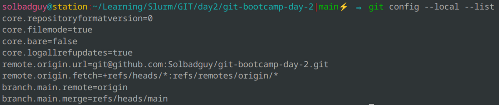
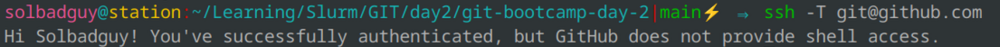
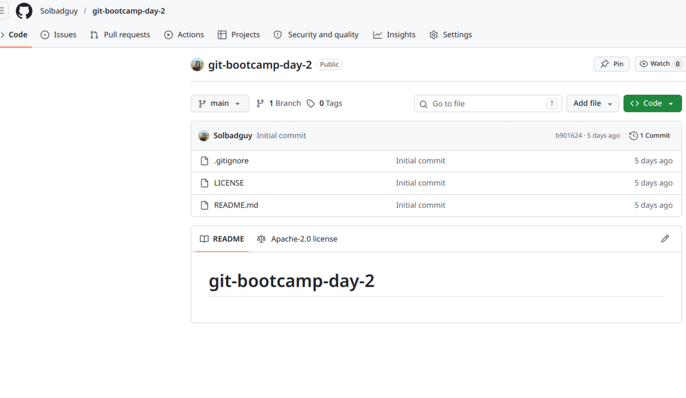
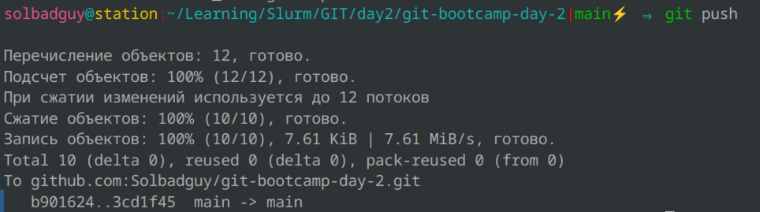
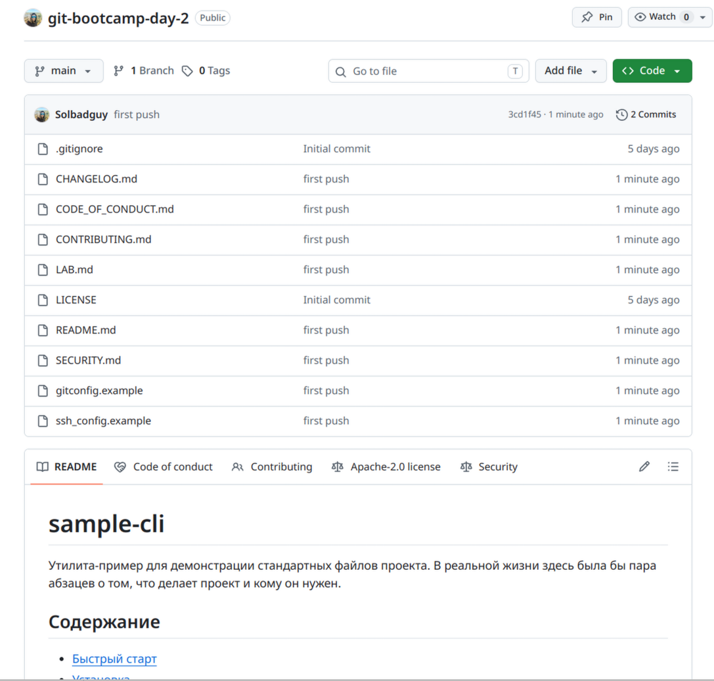

# LAB — день 2

Отчёт о выполнении домашнего задания дня 2 в рамках курса ["Интенсив по погружению в GIT"](https://slurm.io/git-intensive): настройка `gitconfig` и SSH, создание публичного репозитория, наполнение его служебными и стандартными файлами.

## Содержание

- [LAB — день 2](#lab--день-2)
  - [Содержание](#содержание)
  - [Настройка gitconfig](#настройка-gitconfig)
  - [SSH-ключ и подключение к GitHub](#ssh-ключ-и-подключение-к-github)
  - [Создание репозитория](#создание-репозитория)
  - [Служебные файлы](#служебные-файлы)
    - [`.gitignore`](#gitignore)
    - [`.gitattributes`](#gitattributes)
  - [Стандартные файлы и выбор лицензии](#стандартные-файлы-и-выбор-лицензии)
    - [Почему именно эта лицензия](#почему-именно-эта-лицензия)
  - [Markdown](#markdown)
  - [Финальный пуш](#финальный-пуш)

## Настройка gitconfig

Настроены параметры:

user.name
user.email
init.defaultBranch - установлено значение main
core.editor - установлен редактор по-умолчанию - nano

Скриншот вывода `git config --global --list`:



Полный фрагмент моего конфига — в файле [`gitconfig.example`](gitconfig.example).

## SSH-ключ и подключение к GitHub

Для ключа использовал свежий алгоритм ed25519, passphrase не использовал.
Скриншот ответа GitHub на `ssh -T git@github.com`:



Фрагмент моего `~/.ssh/config` — в файле [`ssh_config.example`](ssh_config.example).

## Создание репозитория
Изначально репозиторий создал приватным, затем изменил видимость в настройках, при создании добавил дефолтные README/license, правильные пушил потом.

Скриншот свежесозданного репозитория:



## Служебные файлы

### `.gitignore`

Стек: `<Python>`. Выбрал, потому что иногда пишу на нем скрипты.

За основу взял шаблон с `https://www.toptal.com/developers/gitignore/api/python`

### `.gitattributes`

Минимум — `* text=auto` для нормализации переносов строк между macOS/Linux и Windows. Дополнительные правила:

```text
*.sh  text eol=lf
*.png binary
```

## Стандартные файлы и выбор лицензии

В корне лежат:

- [`README.md`](README.md) — визитка проекта.
- [`CHANGELOG.md`](CHANGELOG.md) — формат Keep a Changelog.
- [`LICENSE`](LICENSE) — выбранная лицензия.
- [`CONTRIBUTING.md`](CONTRIBUTING.md) — как контрибьютить.
- [`CODE_OF_CONDUCT.md`](CODE_OF_CONDUCT.md) — Contributor Covenant.
- [`SECURITY.md`](SECURITY.md) — политика раскрытия уязвимостей.

### Почему именно эта лицензия
Лицензия 
GNU GPLv3 
Хочу, чтобы любые форки и любые доработки оставались открытыми, а упоминание автора сохранялось. Эта лицензия гарантирует это, и злые компании не смогут закрыть код.

Ссылка на дерево решений: https://choosealicense.com/]

## Markdown

> [FIXME: перед коммитом убедитесь, что в ваших `README.md` и/или `LAB.md` суммарно есть всё перечисленное ниже. Шаблон уже содержит большую часть, но проверка за вами.
> Чек-лист (`- [ ]`/`- [x]`) ожидается в `README.md` (например, в секции `## TODO`), не здесь.]

В этом отчёте и в `README.md` использованы:

- заголовки `H1`/`H2`/`H3`;
- оглавление в начале со ссылками на якоря;
- блоки кода с подсветкой (`bash`, `text`);
- сворачиваемый блок (см. ниже);
- ссылки на внешние URL.

<details>
<summary>Пример сворачиваемого блока</summary>
ping 1.1.1.1      
PING 1.1.1.1 (1.1.1.1) 56(84) bytes of data.
64 bytes from 1.1.1.1: icmp_seq=1 ttl=59 time=13.7 ms
64 bytes from 1.1.1.1: icmp_seq=2 ttl=59 time=13.4 ms
64 bytes from 1.1.1.1: icmp_seq=3 ttl=59 time=13.4 ms
</details>

## Финальный пуш
пушил в main, тк проект учебный и ничего критичного это не создаст. Предупреждений от гитхаб не было. Публичным репозиторий сделал уже после создания в настройках.

Терминал с пушем:



Главная страница репозитория после пуша:



